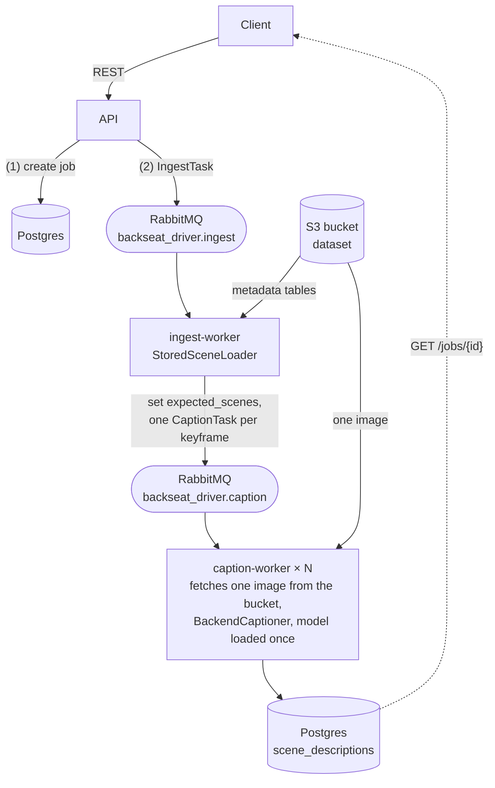

# Distributed mode

This is rung 3 of [From pipeline to cluster](ladder.md). The batch CLI is the primary deliverable: one process, one flow, read → process → write. Distributed mode is an **optional layer around that same flow**, not a rewrite of it. The ingest worker is the read step turned into a producer, and the caption worker runs the same `describe_keyframe()` step the CLI pipeline uses, so what a scene's description *is* lives in one place; the queue only decides *where* each step runs. Across machines two things change because nothing is shared any more: the dataset moves to a bucket (`read/s3/`), and the job store (results and job state), which the seam already needed as a SQLite file, moves to a shared Postgres database (`transport/job_store/`).

## Microservices vs. monolith

This repository is a monorepo of microservices (`api`, `ingest-worker`, `caption-worker`, the report UI, one-shot `dataset-upload` and `db-init`), each built into its own image from the same package. The same code can also be debugged as a monolith: one process runs the API and both workers together. **Debugging as a monolith drops S3 and RabbitMQ** (and Postgres): the queue is in-process, job state is a SQLite file, and images are read in place from the local dataroot, so nothing but the API and the dataset on disk is needed.

`BACKSEAT_DRIVER_MODE` picks which of the two the API runs `/jobs` as; `stacks.build_job_backend` wires the matching `JobQueue` and `JobStore`.

| Mode | Queue / store | Used by |
|---|---|---|
| `monolith` (default) | `InProcessJobQueue` / `SqlJobStore` over SQLite / `LocalImageStore` — the same `IngestWorker` and `CaptionWorker` handlers run on one background thread inside the API process, sharing its captioner. No RabbitMQ, no Postgres, no S3 | `just dev`, `just serve`: nothing but the API (and the dataset in `./data`) is needed. Jobs are kept in a SQLite file (`BACKSEAT_DRIVER_JOBS_DB_PATH`) so they survive a restart |
| `distributed` | `CeleryJobQueue` (RabbitMQ) / `SqlJobStore` / S3 dataset bucket | `docker compose` and Kubernetes, which set the mode and run every service below; and `just dev-distributed` to debug the host-run API against local infrastructure |

To debug the distributed path locally, run `just dev-distributed` (starts RabbitMQ + Postgres + the dev S3 store in Docker and the API on the host with `BACKSEAT_DRIVER_MODE=distributed`), then `just worker-ingest` and `just worker-caption` in other terminals.

The API's HTTP surface is identical in both modes; only where the work runs differs.

## Services

| Service | Command | Role |
|---|---|---|
| `api` | `fastapi run backseat_driver/api/app.py` | `POST /jobs` (202), `GET /jobs/{id}`, `GET /jobs/{id}/descriptions`, `GET /jobs` (the jobs newest first, optionally by state), `GET /images/{key}` (a keyframe image by its dataset key, from the local dataroot or the bucket), plus the synchronous `/describe` |
| `ingest-worker` | `backseat-driver worker ingest` | Downloads the dataset's metadata tables from the bucket, finds the keyframes and fans out one caption task per keyframe (a scene and a camera). `--once` handles a single task and exits (a Job per queued task, see below) |
| `caption-worker` | `backseat-driver worker caption` | Downloads one keyframe from the bucket, captions it and stores the result; scale horizontally |
| `dataset-upload` | `backseat-driver dataset upload` | One-shot: copies the dataset from disk into the bucket (the only step that reads it from disk; reruns skip images already there) |
| `db-init` | `backseat-driver db init` | One-shot: creates the tables |
| `rabbitmq`, `postgres` | | Broker and job store |
| `s3` | `adobe/s3mock` (compose and the k8s base only) | Development stand-in for the dataset bucket; production points at a real S3-compatible bucket |

Each service has its own `docker/Dockerfile` target and dependency group: `api`, `ingest-worker` (nuscenes-devkit, no torch), `caption-worker` (torch, no nuscenes-devkit), and `cli` (everything, also used by `db-init`). Build one with `docker build -f docker/Dockerfile --target caption-worker .`.

Run it with `just up` (and `just compose up --scale caption-worker=4` to add workers), or on Kubernetes with `just k8s-apply` (see [Deployment](deployment.md)). The dataset must be in `./data` for the `dataset-upload` service, the only one that mounts it; ingest waits for the upload to finish, and neither worker ever sees the dataset on disk.

## Design choices

- **Messages carry references, not pixels, and workers share no filesystem.** The dataset lives in an S3-compatible bucket (`DatasetStore` / `ImageStore` ports in `read/` and `read/s3/`), put there once by `dataset upload` in its own layout (`<version>/*.json`, `samples/<camera>/*`). Ingest downloads only the metadata tables and puts each keyframe's object URI in `CaptionTask.image_uri`; the caption worker downloads that one image to a temporary file, captions it and deletes it. The keyframe's `image_path` is the dataset-relative key, so stored descriptions name the dataset image. In the monolith `LocalImageStore` passes the local path straight through. Configure the bucket with `BACKSEAT_DRIVER_DATASET_BUCKET` (no default; the workers refuse to start without it) and `BACKSEAT_DRIVER_S3_ENDPOINT_URL` for non-AWS stores; credentials come from the standard `AWS_*` variables. Why this and not a shared volume, a copy per job or ingest in the API: [Design Decisions](design-decisions.md#distributed-mode-and-the-monolith).
- **Ingest can run as a Job per queued task.** With KEDA on Kubernetes, a `ScaledJob` starts one Job per waiting ingest message (`worker ingest --once`: one `basic_get`, run, ack, exit), so nothing runs while the queue is empty; without KEDA, and in compose, it is a plain consumer of the same queue. `--once` fetches the message itself rather than stopping a Celery worker, which would prefetch and run the next message first.
- **Job state is derived, not stored.** `pending` until ingest records `expected_scenes`, `running` while `completed < expected`, `completed` after. There is no "mark done" step to race between workers.
- **At-least-once, idempotent.** A message is acked only after its result is written. `(job_id, scene_token, camera_channel)` is the primary key (a multi-camera job describes a scene once per camera) and inserts use `ON CONFLICT DO NOTHING`, so redelivery is harmless. `expected_scenes` and `completed_scenes` count these rows, one per scene and camera, while `max_scenes` counts scenes, as it does for `describe`. A database created with the old `(job_id, scene_token)` key is not altered by `db init` (it only creates missing tables), but `db init` and the monolith's startup now stop on it with an error instead of letting every caption fail on its `ON CONFLICT` target. On Postgres, to keep the old jobs, run `ALTER TABLE scene_descriptions DROP CONSTRAINT scene_descriptions_pkey, ADD PRIMARY KEY (job_id, scene_token, camera_channel);` (confirm the constraint's name with `\d scene_descriptions`); the monolith's `output/jobs.db` can simply be deleted, as SQLite cannot change a key in place.
- **Workers are Celery workers** (`backseat_driver/tasks.py`), over RabbitMQ quorum queues, with late acks and one message at a time. A task that fails is retried with backoff up to 3 times, except malformed messages, which are never retried. After that the failure is logged with its `transaction_id`, the message is dropped, and its job becomes `failed` with the task kept as a dead letter (`GET /jobs/{id}/dead-letters`). Remote control and gossip are off because RabbitMQ 4 rejects the transient queues they need.
- **Fail fast at startup, tolerant at construction.** Clients never connect in their constructors (so tests and `--help` need no infrastructure); `/ready` reports broker and database reachability, and compose gates the API on both being healthy. The caption worker loads its model before consuming.
- **Every job has a `transaction_id`** (the caller's `X-Request-ID` when it is 1-128 characters of `A-Za-z0-9._-`, else a generated one). It is stored on the job, returned by the API, carried in every queue message body (and mirrored in the `X-Request-ID` header), and bound to every API and worker log line as `transaction_id` (workers add the `job_id`), so one identifier follows a request across all services.
- **A job that cannot finish is `failed`, with the reason in `error`.** The API marks it when the ingest task cannot be enqueued; a worker marks it when a task runs out of retries (a transient error that a retry fixes never does). The first error is kept, and the task itself is kept whole as a dead letter ([Design Decisions](design-decisions.md#dead-letters)). Existing databases need the new `jobs.error` and `jobs.idempotency_key` columns (`db init` only creates missing tables), so drop the dev database or add them by hand.
- **`POST /jobs` accepts an `Idempotency-Key` header.** Retrying with the same key returns the job it created (200) instead of starting another (a unique index enforces it, so two retries that arrive at the same moment still end up with one job: the loser is answered with the winner's). Without the header every request starts a job, as before.

## Scaling

Caption workers run the solo pool (the model loads once per process and CUDA is never forked), so scale by adding processes or containers. They are stateless consumers of one queue, so throughput scales with replica count. On Kubernetes they can autoscale on queue depth with KEDA (see [Deployment](deployment.md#autoscaling-and-the-local-kind-cluster)).

## Not done yet

- Replaying dead letters, and recovering monolith jobs interrupted by a restart.
- Letting the `dataset-upload` step download the dataset archive itself instead of reading it from disk; GPU node pools.
- Autoscaling the API (needs metrics-server).
