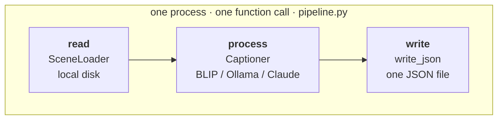
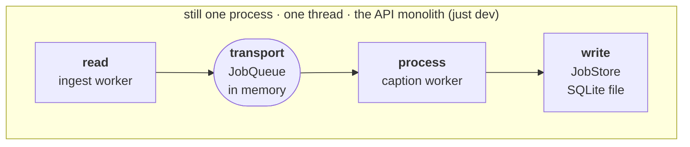
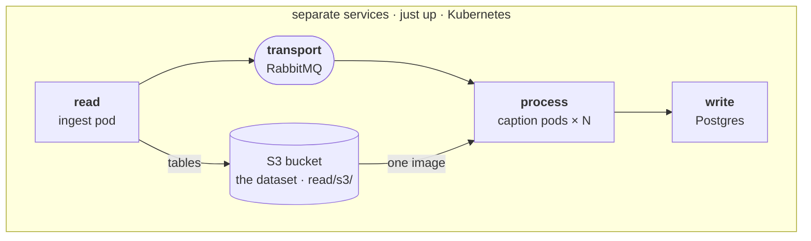
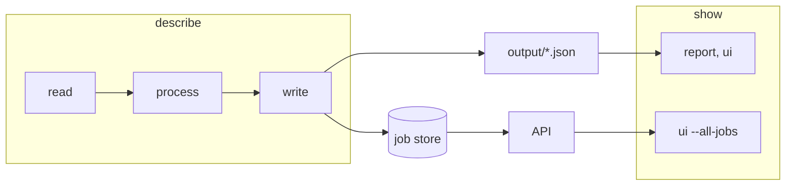

# From pipeline to cluster

Backseat Driver is one idea: **read** the scenes, **process** each image with a vision-language model, **write** the descriptions. Everything else in the repository is that idea stretched across more machines. This page shows how, one rung at a time, and where each added piece enters the code.

Showing the results is a separate role. It reads what was written and never takes part in the three steps (see [Describe and show](#describe-and-show)).

## Rung 1: the pipeline



```bash
just describe --camera front        # = uv run backseat-driver describe ...
```

`describe` loads the keyframes, calls `describe_keyframe` for each, and writes the list. Nothing is queued, stored or served. This is the whole program, and the code that runs it is [`pipeline.py`](https://github.com/shoham-b/backseat-driver/blob/main/backseat_driver/pipeline.py).

**Code, in reading order**

| Step | Port | Adapter | Wired in |
|---|---|---|---|
| read | [`SceneLoader`](https://github.com/shoham-b/backseat-driver/blob/main/backseat_driver/read/scene_loader.py) | [`NuScenesSceneLoader`](https://github.com/shoham-b/backseat-driver/blob/main/backseat_driver/read/nuscenes_scene_loader.py) | [`stacks.pipeline`](https://github.com/shoham-b/backseat-driver/blob/main/backseat_driver/stacks.py) |
| process | [`Captioner`](https://github.com/shoham-b/backseat-driver/blob/main/backseat_driver/process/captioner.py) | [`BackendCaptioner`](https://github.com/shoham-b/backseat-driver/blob/main/backseat_driver/process/backend_captioner.py) over a [HuggingFace](https://github.com/shoham-b/backseat-driver/blob/main/backseat_driver/process/backends/huggingface.py), [Ollama](https://github.com/shoham-b/backseat-driver/blob/main/backseat_driver/process/backends/ollama.py) or [Anthropic](https://github.com/shoham-b/backseat-driver/blob/main/backseat_driver/process/backends/anthropic.py) backend | [`process.factory`](https://github.com/shoham-b/backseat-driver/blob/main/backseat_driver/process/factory.py) |
| write | | [`write_json`](https://github.com/shoham-b/backseat-driver/blob/main/backseat_driver/write/json_writer.py) | [`cli/describe.py`](https://github.com/shoham-b/backseat-driver/blob/main/backseat_driver/cli/describe.py) |

Tests: [`test_pipeline.py`](https://github.com/shoham-b/backseat-driver/blob/main/tests/unittests/test_pipeline.py), [`tests/unittests/read/`](https://github.com/shoham-b/backseat-driver/tree/main/tests/unittests/read), [`process/`](https://github.com/shoham-b/backseat-driver/tree/main/tests/unittests/process), [`write/`](https://github.com/shoham-b/backseat-driver/tree/main/tests/unittests/write), and the command itself in [`test_pipeline_end_to_end.py`](https://github.com/shoham-b/backseat-driver/blob/main/tests/integrationtests/cli/test_pipeline_end_to_end.py).

## Rung 2: the seam



```bash
just dev            # POST /jobs on :8080
```

The API turns the run into tasks. **Ingest** is the read step turned into a producer: it reads once and enqueues one task per image. The **caption worker** is the process and write steps run once per task. Both still run on a background thread inside the API process, so nothing extra is needed. The queue (`transport/`) is the only new thing, and it is a seam: a place where read and process could be pulled apart.

**Code, in reading order**

| What | Where |
|---|---|
<<<<<<< HEAD
| The seam, in one docstring | [`transport/__init__.py`](../backseat_driver/transport/__init__.py) |
| The queue port and its in-process adapter | [`JobQueue`](../backseat_driver/transport/job_queue.py), [`InProcessJobQueue`](../backseat_driver/transport/in_process_job_queue.py) |
| Read as a producer; process and write per task | [`IngestWorker`](../backseat_driver/transport/ingest_worker.py), [`CaptionWorker`](../backseat_driver/transport/caption_worker.py), both reusing [`describe_keyframe`](../backseat_driver/pipeline.py) |
| The job store the workers write to | [`JobStore`](../backseat_driver/write/job_store/job_store.py), [`SqlJobStore`](../backseat_driver/write/job_store/sql_job_store.py) over SQLite, [`InMemoryJobStore`](../backseat_driver/write/job_store/in_memory_job_store.py) |
| The front door | [`POST /jobs`](../backseat_driver/api/routers/jobs.py) |
| Wired in | [`stacks.seam`](../backseat_driver/stacks.py) |
=======
| The seam, in one docstring | [`transport/__init__.py`](https://github.com/shoham-b/backseat-driver/blob/main/backseat_driver/transport/__init__.py) |
| The queue port and its in-process adapter | [`JobQueue`](https://github.com/shoham-b/backseat-driver/blob/main/backseat_driver/transport/job_queue.py), [`InProcessJobQueue`](https://github.com/shoham-b/backseat-driver/blob/main/backseat_driver/transport/in_process_job_queue.py) |
| Read as a producer; process and write per task | [`IngestWorker`](https://github.com/shoham-b/backseat-driver/blob/main/backseat_driver/transport/ingest_worker.py), [`CaptionWorker`](https://github.com/shoham-b/backseat-driver/blob/main/backseat_driver/transport/caption_worker.py), both reusing [`describe_keyframe`](https://github.com/shoham-b/backseat-driver/blob/main/backseat_driver/pipeline.py) |
| The job store the workers write to | [`JobStore`](https://github.com/shoham-b/backseat-driver/blob/main/backseat_driver/write/job_store/job_store.py), [`SqlJobStore`](https://github.com/shoham-b/backseat-driver/blob/main/backseat_driver/write/job_store/sql_job_store.py) over SQLite, [`InMemoryJobStore`](https://github.com/shoham-b/backseat-driver/blob/main/backseat_driver/write/job_store/in_memory_job_store.py) |
| The front door | [`POST /jobs`](https://github.com/shoham-b/backseat-driver/blob/main/backseat_driver/api/routers/jobs.py) |
| Wired in | [`stacks.seam`](https://github.com/shoham-b/backseat-driver/blob/main/backseat_driver/stacks.py) |
>>>>>>> 23ffc87 (docs: fix links, diagrams and stale claims; split architecture into APIs and Technology)

Tests: [`tests/unittests/transport/`](https://github.com/shoham-b/backseat-driver/tree/main/tests/unittests/transport), [`write/job_store/`](https://github.com/shoham-b/backseat-driver/tree/main/tests/unittests/write/job_store), and the API end to end in [`tests/integrationtests/api/`](https://github.com/shoham-b/backseat-driver/tree/main/tests/integrationtests/api).

## Rung 3: machines



Once the queue crosses machines, two things stop working, and the two remaining additions replace them:

| Without the seam | Across machines | Replaced by |
|---|---|---|
| Images are read from the local disk | The caption pod cannot see the ingest pod's disk | **S3**: `read/s3/` holds the dataset in a bucket, and each task carries the image's URI |
| Descriptions are collected and written to one file | No process holds all of them | **A shared job store**: `write/job_store/` records one row per description in Postgres |

**Code, in reading order**

| What | Where |
|---|---|
| RabbitMQ as the queue | [`CeleryJobQueue`](https://github.com/shoham-b/backseat-driver/blob/main/backseat_driver/transport/celery_job_queue.py), the tasks and worker entrypoints in [`tasks.py`](https://github.com/shoham-b/backseat-driver/blob/main/backseat_driver/tasks.py), `worker ingest --once` in [`consume_one.py`](https://github.com/shoham-b/backseat-driver/blob/main/backseat_driver/transport/consume_one.py) |
| The dataset in a bucket | [`read/s3/`](https://github.com/shoham-b/backseat-driver/tree/main/backseat_driver/read/s3): [`S3DatasetStore`](https://github.com/shoham-b/backseat-driver/blob/main/backseat_driver/read/s3/s3_dataset_store.py), [`StoredSceneLoader`](https://github.com/shoham-b/backseat-driver/blob/main/backseat_driver/read/s3/stored_scene_loader.py), the one-time [`DatasetUploader`](https://github.com/shoham-b/backseat-driver/blob/main/backseat_driver/read/s3/uploader.py) |
| Results in Postgres | [`SqlJobStore`](https://github.com/shoham-b/backseat-driver/blob/main/backseat_driver/write/job_store/sql_job_store.py) over [`orm.py`](https://github.com/shoham-b/backseat-driver/blob/main/backseat_driver/write/job_store/orm.py) and [`storage.py`](https://github.com/shoham-b/backseat-driver/blob/main/backseat_driver/write/job_store/storage.py) |
| Submitting from the CLI | [`ApiJobClient`](https://github.com/shoham-b/backseat-driver/blob/main/backseat_driver/transport/api_client.py) behind `describe --mode distributed` |
| Wired in | [`stacks.machines`](https://github.com/shoham-b/backseat-driver/blob/main/backseat_driver/stacks.py), `celery_queue`, `postgres_store`, `stored_loader` |

Tests: [`tests/unittests/read/s3/`](https://github.com/shoham-b/backseat-driver/tree/main/tests/unittests/read/s3), [`tests/integrationtests/read/s3/`](https://github.com/shoham-b/backseat-driver/tree/main/tests/integrationtests/read/s3), [`tests/unittests/transport/`](https://github.com/shoham-b/backseat-driver/tree/main/tests/unittests/transport) and [`tests/integrationtests/transport/`](https://github.com/shoham-b/backseat-driver/tree/main/tests/integrationtests/transport).

## What changes, and what does not

The models (`SceneKeyframe` in, `SceneDescription` out), the three ports and `describe_keyframe` are the same at every rung. The hand-off and the write contract change:

| Stage | Rung 1: pipeline | Rung 2: seam | Rung 3: machines |
|---|---|---|---|
| **Read** | The loader returns a list of keyframes | Ingest reads, then enqueues one task per keyframe | Same, with images and tables from S3 |
| **Hand-off** | A function call over the list | `InProcessJobQueue` | `CeleryJobQueue` over RabbitMQ |
| **Process** | `describe_keyframe` in a loop | The same function, once per task | The same function, on N pods |
| **Write** | Collect everything, then write one JSON file | One row per result (SQLite) | One row per result (Postgres) |
| **Job state** | None; the run just ends | Derived from counts | Derived from counts and safe to redeliver |

The real difference is in the write. At rung 1 it is a batch at the end. From rung 2 up, results arrive one at a time, in any order and possibly twice, so the write must be incremental and idempotent, and "is the job finished" is derived from counts instead of being a step someone performs.

## Where each piece lives

```
backseat_driver/
├── models/          SceneKeyframe, SceneDescription ...       shared by every rung
├── read/            SceneLoader, ImageStore, local loader     ┐
├── process/         Captioner, backends                       ├ the core (rung 1)
├── write/           write_json                                │
├── pipeline.py      read -> process, run by `describe`        ┘
│
├── transport/       JobQueue, ingest + caption workers        ┐ rung 2: the seam
│                    InProcessJobQueue, CeleryJobQueue         ┘ (Celery: rung 3)
├── read/s3/         bucket-backed ImageStore and loader       ┐ rung 3: what crossing
├── write/job_store/ JobStore, SQLite and Postgres             ┘ machines forces
│
├── stacks.py        which adapter each rung plugs into each port   the wiring, in one place
├── show/            report and UI over what was written       separate role
├── api/             /jobs, /images, /describe                 the front door of rungs 2-3
└── cli/             describe, report, ui, worker, db, dataset
```

The core never imports the added packages. `tests/unittests/test_layering.py` checks that on every run: `read`, `process`, `write`, `pipeline` and `models` may not import `transport`, `read/s3`, `write/job_store`, Celery, boto3 or SQLAlchemy.

## The wiring in one file

[`stacks.py`](https://github.com/shoham-b/backseat-driver/blob/main/backseat_driver/stacks.py) is where the table above becomes code. It has one recipe per rung, and each only builds the adapters for it:

| Port | Rung 1: pipeline | Rung 2: seam | Rung 3: machines |
|---|---|---|---|
| Scene loader | `NuScenesSceneLoader` | `RelativeSceneLoader` | `StoredSceneLoader` (tables from the bucket) |
| Image store | `LocalImageStore` | `LocalImageStore` | `S3DatasetStore` |
| Queue | none | `InProcessJobQueue` | `CeleryJobQueue` |
| Captioner | `BackendCaptioner` | `BackendCaptioner` | `BackendCaptioner` |
| Write | `write_json` | `SqlJobStore` (SQLite) | `SqlJobStore` (Postgres) |

`describe` calls `stacks.pipeline`, the API calls `stacks.build_job_backend` (which picks `seam` or `machines` from `BACKSEAT_DRIVER_MODE`), and the Celery workers build their ends from `stored_loader`, `celery_queue` and `postgres_store`. To see what a rung is made of, read its function.

## One command, either rung

```bash
uv run backseat-driver describe --camera front --model Salesforce/blip-image-captioning-base
uv run backseat-driver describe --mode distributed --output output/cluster.json
```

`--mode distributed` submits the same job to a running API, waits for the workers, and writes the same JSON file as rung 1. The model, camera and dataset are the workers' own settings, so those flags are rejected in that mode, and `--output` is required because the client cannot know which model the workers use.

## Describe and show



`describe` produces descriptions. `report` and `ui` (`show/`) read them from JSON files, or from the API's completed jobs, score them against the nuScenes label and render the comparison page. They never run a model or open the dataset, so the UI deployment mounts nothing.

## Where to go next

- [Running it](running.md): each rung's commands side by side.
- [Distributed mode](distributed.md): rung 3 in detail (services, scaling, delivery guarantees).
- [Design decisions](design-decisions.md): why a queue, why a bucket, why a monolith mode.
