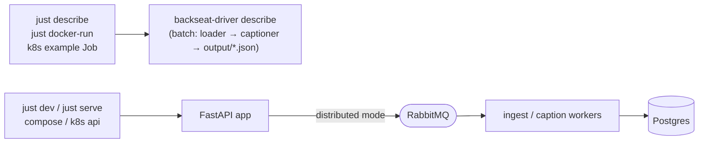

# Running it

The program is read → process → write, and there are three ways to run it: each rung adds one thing to the one before. [From pipeline to cluster](ladder.md) has the diagrams; this page is the commands. They all run the same code and read the same `BACKSEAT_DRIVER_*` settings.

| Rung | Command | What runs | Adds | Needs |
|---|---|---|---|---|
| **1. Pipeline** | `just describe` | read, process and write in one function call | nothing | dataset in `data/` |
| **2. Seam** | `just dev` | the same steps as tasks on the API's event loop, `POST /jobs` | an in-process queue and a SQLite job store | dataset in `data/` |
| **3. Machines** | `just up`, `just k8s-apply` | ingest and caption workers as separate services | RabbitMQ, an S3 bucket (images) and Postgres (results) | Docker or a cluster |

`describe --mode distributed` is the bridge: it submits the pipeline as a job to a rung 2 or rung 3 API and writes the same JSON file as rung 1. Showing the results (`just report`, `just ui`) is separate from all three and only reads what was written.

## Where each rung runs

| Mode | What runs where | Commands |
|---|---|---|
| **1. Dev: local** | Everything on your machine, no Docker. The API runs as a **monolith** (`BACKSEAT_DRIVER_MODE=monolith`, the default): `/jobs` is processed as a task on the API's event loop with a SQLite file as its store and the dataset read from `data/`, so the broker (RabbitMQ), the object store (S3), the database and the separate workers are all dropped. To debug against real infrastructure instead, `just dev-distributed` runs the host API in distributed mode with RabbitMQ + Postgres in Docker. | `just dev`, `just dev-distributed`, `just describe` |
| **2. Prod-like: Docker Compose** | The same images production uses, the whole stack on one machine. | `just up` (`just up-dev` hot-reloads the API) |
| **3. Prod: one container per service** | Each service runs from its own image. In Kubernetes, RabbitMQ and Postgres come from the cluster (or managed services), so nothing here starts infra. | `just k8s-apply` (see [Deployment](deployment.md)); `just k8s-up` for a local kind cluster with autoscaling; `just serve` is the API's command outside a container |

The batch pipeline (`backseat-driver describe`) works in all three: on the host (`just describe`), in a container (`just docker-run`), or as a Kubernetes Job.

## Every way to run it

| I want to… | Command | Runs on | Needs |
|---|---|---|---|
| Describe the dataset once | `just describe` (= `uv run backseat-driver describe`) | host | dataset in `data/` |
| …in a container instead | `just docker-run` (= `just compose --profile cli run --rm cli describe`) | Docker | dataset in `data/` |
| Debug the API locally | `just dev` (`fastapi dev`, monolith: `/describe`, `/ready` and `/jobs` all work in-process, no Docker) | host | dataset in `data/` for `/jobs` |
| …against real RabbitMQ + Postgres | `just dev-distributed`, plus `just worker-ingest` / `just worker-caption` | API and workers on host, RabbitMQ + Postgres in Docker | Docker, dataset |
| Run the API in production mode | `just serve` (monolith unless `BACKSEAT_DRIVER_MODE=distributed`) | host | nothing, or RabbitMQ + Postgres in distributed mode |
| Run the queue workers on the host | `just worker-ingest` / `just worker-caption` (start infra first) | same | Docker, dataset |
| The whole distributed stack | `just up` (`just up-dev` hot-reloads the API) | Docker Compose | Docker, dataset |
| The model-comparison UI | `just ui` (host) or `just compose --profile ui up ui` | host / Docker | results in `output/` |
| The same stack in a cluster | `just k8s-apply` | Kubernetes | cluster, dataset volume |
| ...on a local kind cluster, autoscaling | `just k8s-up` | kind | Docker, kind, dataset in `data/` |

`just --list` shows every recipe; the per-recipe comments say what each needs.

## How the pieces relate



`/describe` is synchronous. In distributed mode `/jobs` and `/ready` need RabbitMQ and Postgres; in the default monolith mode `just dev` runs the workers inside the API process.

- **One Dockerfile, a target per service.** `docker/Dockerfile` builds `cli` (the pipeline, `db init`, the report UI; entrypoint `backseat-driver`), `api` (`fastapi run`), `ingest-worker` (no torch) and `caption-worker` (torch). Compose builds them locally; CI pushes them to `ghcr.io/shoham-b/backseat-driver-{cli,api,ingest-worker,caption-worker}`, which the Kubernetes manifests pull. All run as the non-root user `app` (uid 10001).
- **`BACKSEAT_DRIVER_MODE` decides whether `/ready` needs infrastructure.** In the default `monolith` mode the queue and store live in the API process, so `just dev` is ready with nothing else running. In `distributed` mode (compose, Kubernetes, `just dev-distributed`) the API checks RabbitMQ and Postgres, so one started without them reports not-ready. `just infra` (local only; run for you by `just dev-distributed` and `just worker-*`, never needed in Kubernetes) starts them (plus the dev S3 store) in Docker, publishes them on `127.0.0.1:5672` / `5432` / `9090` (the defaults in `.env.example`; set the `BACKSEAT_DRIVER_DATASET_BUCKET` block there for host-run workers and run `uv run backseat-driver dataset upload` once) and creates the schema.
- **Containers don't read `.env`.** Its `localhost` URLs would be wrong inside a container. Compose instead interpolates the captioner settings (`BACKSEAT_DRIVER_VLM_BACKEND`, model names, `ANTHROPIC_API_KEY`, …) from your shell or `.env`, so `BACKSEAT_DRIVER_VLM_BACKEND=ollama just up` and a `.env` entry behave the same. Broker and database URLs always point at the compose services.
- **Ollama on the host.** Containers reach it at `host.docker.internal:11434`; override with `BACKSEAT_DRIVER_COMPOSE_OLLAMA_URL`.
- **Model weights are cached** in the `hf-cache` volume, so repeat runs don't re-download them.
- **The dataset is never baked into an image.** Compose bind-mounts `./data` read-only; Kubernetes mounts the `nuscenes-data` claim. Only the one-shot `dataset upload` reads it from disk: it copies the dataset into an S3-compatible bucket, ingest reads the metadata tables from there and the queue messages carry each image's object URI, so no worker has the dataset on disk (`just infra` and compose start a development store, `s3`, on `127.0.0.1:9090`; see [Distributed mode](distributed.md)).

## Docker Compose

```bash
just docker-run --camera front --max-scenes 2   # one-off pipeline run, writes ./output
just up                          # api :8080, rabbitmq UI :15672, postgres, db-init, ingest-worker, 2 × caption-worker
just compose up --scale caption-worker=4
just test-system                # builds, starts the stack, runs system + smoke tests, tears down
```

## Kubernetes

`deploy/k8s` is a kustomize base with the same topology as compose, plus the report UI. [Deployment](deployment.md) lists the objects, the dataset and credentials you must supply, and what CI checks.

```bash
just k8s-render     # inspect
just k8s-validate   # check the rendered YAML against the Kubernetes schemas
just k8s-apply      # kubectl apply -k deploy/k8s
```
